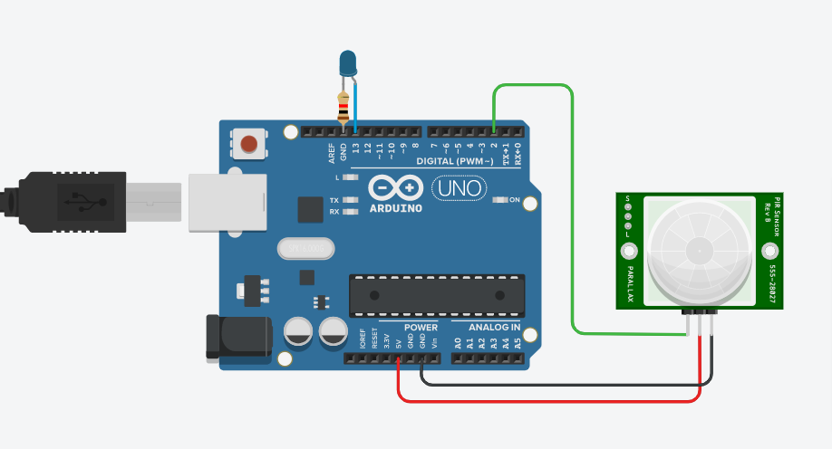
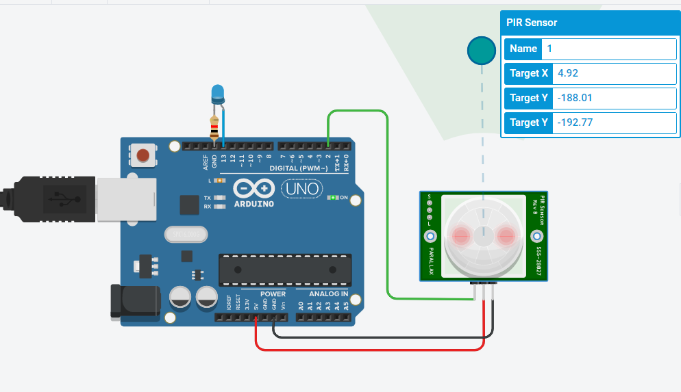

# PIR SENSOR PROJECT

## Components
| Name | Quantity | Component |
| ----------- | ----------- | ----------- |
| U1 | 1 | Arduino Uno R3 |
| R1 | 1 | 1 k-ohm Resistor |
| D1 | 1 | Blue LED |
| PIR1 | 1 | PIR Sensor |

## Preview
Before, run the program :

After, run the program :

## Project Code
Click here, [PIR Sensor Project Code Link](pir-sensor.ino)
